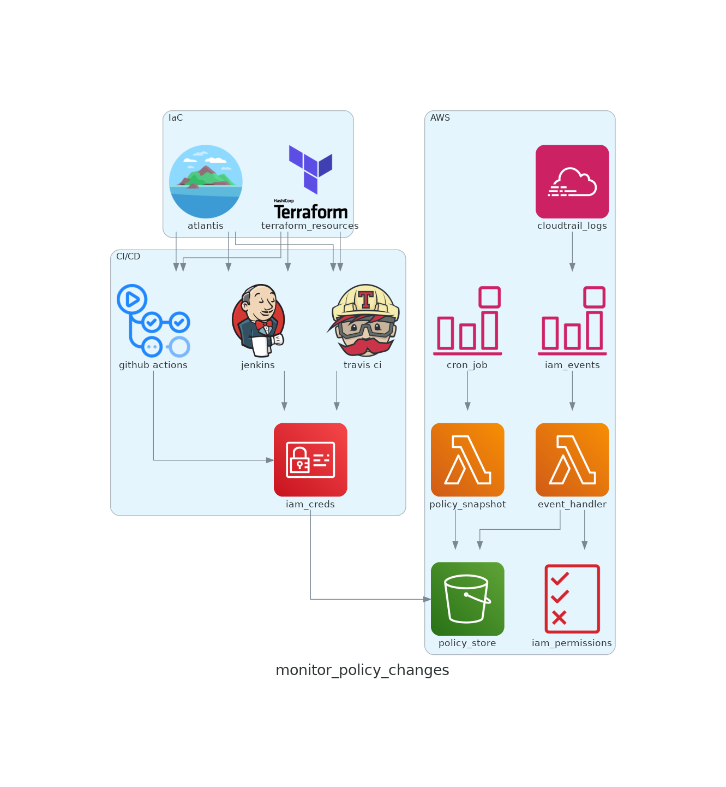

# IAM Keeper

IAM Keeper is to revert the state of IAM User and Role to the baseline if non-designated credentials make changes

**DISCLAIMER**: It is NOT ready for production usage, and it was created as part of a class project

## How It Works

Below is the architecture diagram of this solution

* [AWS CloudTrail](https://docs.aws.amazon.com/awscloudtrail/latest/userguide/cloudtrail-userguide.html) is used to collect logs of events happening in the AWS environment.

* [AWS CloudWatch Event](https://docs.aws.amazon.com/AmazonCloudWatch/latest/events/WhatIsCloudWatchEvents.html
) is to listen to cloudtrail logs and get just the relevant events I need for my use cases based on certain set of rules. It is also used to send those events to my lambda functions. CloudWatch Event can act as a cron job to trigger the lambda functions on a schedule.

* [Lambda function](https://docs.aws.amazon.com/lambda/latest/dg/welcome.html) event_handler is created to listen for certain events from designated principals related to IAM policy changes that are sent from CloudWatch Events. After that, the lambda function will store the desired state files in the S3 bucket. S3 Bucket will have versions enabled for version tracking. If the event does not come from designated principals, this lambda also does the job of reverting the action performed by retrieving the ideal state files from the S3 bucket and updating the policies/roles/users that are changed previously.

* [Lambda function](https://docs.aws.amazon.com/lambda/latest/dg/welcome.html) policy_snapshot is invoked by a cron job to store the current state of the IAM policies in the S3 bucket. The reason for this lambda is because of the use case when an IAM Role/User is deleted along with all the managed and inline policies. If designated credentials do not perform this action, we want to revert this action. If the policies no longer exist, we need a way to have the previous state of them to be able to revert and the best way is through a cron job.

* After the logs are processed, I will need a place to store ideal state data, and I will use [S3](https://docs.aws.amazon.com/AmazonS3/latest/userguide/Welcome.html) bucket. My solution does not need a SQL or NoSQL database as I only need to store the current state of the existing policies. There is no need to do any complex queries to process the data besides updating and retrieving policies in json format

## Infrastructure as Code

I use Terraform, Terraform Cloud and Github Action for my infrastructure code

* Github action flow defined in `push_ecr.yml` will monitor for changes in the application source code and create and push a new container image version to Elastic Container Registry (ECR) service
* Github action flow defined in `apply_run.yml` will monitor for changes in the terraform source code under `src` folder and apply necessary changes
* Terraform code under `src` folder will create all of the components (Lambda functions, S3, CloudWatch Events)
* Terraform Cloud is used to keep track of the state of infrastructure but you can use other backend

## How To Deploy It

To deploy this solution by cloning this repository.

If you use Github Action, under repo `Settings > Secrets and variables > Actions`, add the following variables

Under `Secrets`:

* `RELEASE_TOKEN`: This the the github token with read permission so terraform cloud can put comments in Github PR
* `TF_API_TOKEN`: The token used to interact with Terraform Cloud

Under `Variables` tab:

* `ECR_IAM_HANDLER_REPO`: The ECR repo to store images of the iam_keeper_event_handler lambda function
* `ECR_POLICY_SNAPSHOT_REPO`: The ECR repo to store images of the iam_keeper_policy_snapshot lambda function
* `TF_CLOUD_ORGANIZATION`: The organization used to store state file in Terraform Cloud
* `TF_WORKSPACE`: The workspace used to store state file in Terraform Cloud

## S3 bucket structure

* roles
  * role_name
    * inline_policies
      * policy_1.json
      * policy_2.json
    * managed_policies/list.json
    * state.txt

* users
  * user_name
    * inline_policies
      * policy_1.json
      * policy_2.json
    * managed_policies/list.json
    * state.txt

* managed_policies
  * policy_1.json
  * policy_2.json
